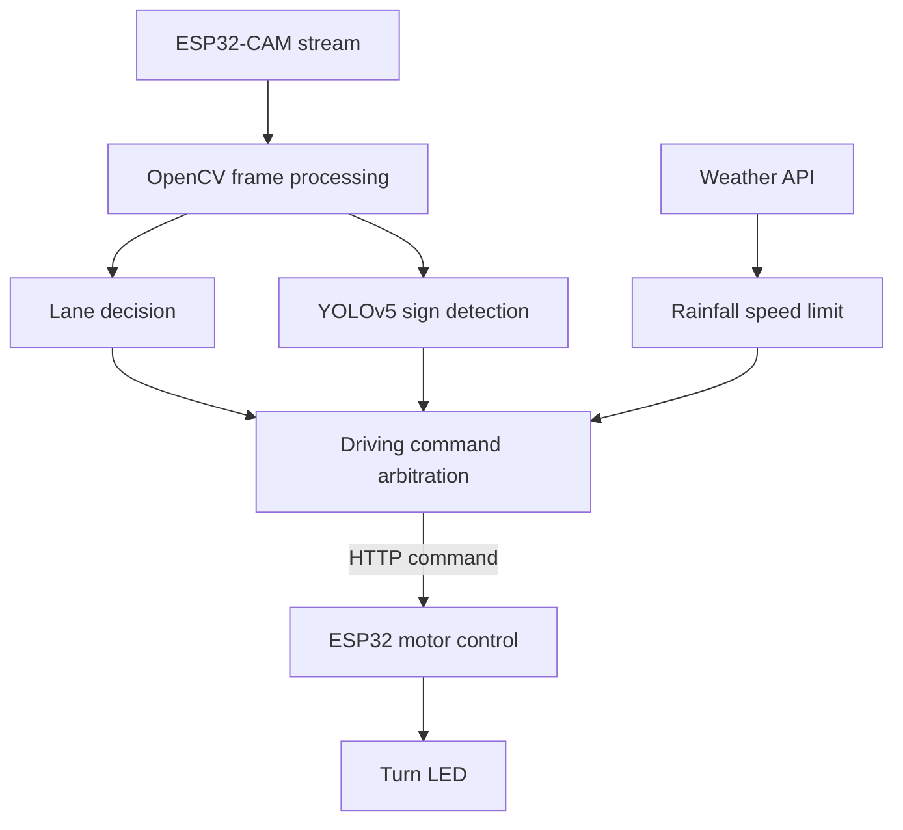

# ESP32-CAM AI RC Car

An autonomous RC car project combining ESP32-CAM video streaming, AI lane-direction classification, YOLOv5 traffic-sign detection, rule-based lane tracking, weather-aware speed control, and turn-signal LEDs.

## Project Overview

This four-person team project was completed in an introductory automotive engineering course. The RC car streams road images from an ESP32-CAM to a PC, where Python processes each frame and returns driving commands through HTTP requests.

The project was developed in stages:

1. Stream and preprocess ESP32-CAM images.
2. Control the RC car with the keyboard.
3. Collect and label `go`, `left`, and `right` lane images.
4. Drive with an image-classification model.
5. Train a custom YOLOv5 model for `stop`, `slow`, and `Uturn` signs.
6. Combine rule-based lane tracking with YOLO sign responses.
7. Limit vehicle speed according to hourly rainfall.
8. Blink the ESP32 LED during turning commands.

## Implemented Features

| Feature | Method | Vehicle response |
|---|---|---|
| Lane-direction classification | Keras model, `224 x 224` ROI | Go, left, or right at confidence >= 80% |
| Rule-based lane tracking | Dark-line mask and centroid offset | Right below `-70`, left above `70`, otherwise forward |
| Traffic-sign detection | Custom YOLOv5 model | Stop, reduce speed, or U-turn at confidence > 0.5 |
| Rain-aware control | OpenWeatherMap current weather API | Limit speed from 100 to 80 when hourly rain >= 5 mm |
| Turn indication | ESP32 GPIO 4 LED | Blink for left, right, turn-left, and turn-right commands |

## System Architecture



## Repository Structure

```text
esp32cam-ai-rc-car/
├── README.md
├── requirements.txt
├── .env.example
├── .gitignore
├── arduino/
│   └── turn_signal_patch.ino
├── config/
│   └── data.yaml
├── models/
│   ├── keras_model.h5
│   └── labels.txt
└── src/
    ├── check_tensorflow.py
    ├── collect_lane_images.py
    ├── capture_yolo_images.py
    ├── detect_custom_objects.py
    ├── drive_with_ai_model.py
    ├── drive_with_weather.py
    ├── drive_with_yolo.py
    └── learning_steps/
        ├── 01_stream_bytes.py
        ├── 02_display_stream.py
        ├── 03_crop_roi.py
        ├── 04_resize_input.py
        ├── 05_read_keyboard.py
        ├── 06_map_keyboard_commands.py
        └── 07_control_rc_car.py
```

## Core Implementations

### 1. AI lane-direction driving

Frames are cropped to the road-facing region, resized to `224 x 224`, normalized to `[-1, 1]`, and classified as `go`, `left`, or `right`. A vehicle command is issued only when model confidence reaches 80%.

### 2. Custom YOLOv5 object detection

Traffic-sign images were captured at different distances and angles, labeled, and trained in Google Colab with a T4 GPU. The custom detector recognizes:

- `stop`: stop the vehicle
- `slow`: continue lane tracking with speed limited to 80
- `Uturn`: command a right-turn maneuver at speed 80

The detector and lane controller run concurrently so that traffic-sign decisions can override the normal lane-following command.

### 3. Rule-based lane tracking

The lower central region of the camera image is filtered to extract the dark lane. Image moments provide the lane centroid, and `center_offset` determines the steering direction.

```python
if center_offset < -70:
    car_state = "right"
elif center_offset > 70:
    car_state = "left"
else:
    car_state = "go"
```

### 4. Weather-aware speed control

The OpenWeatherMap API provides rainfall during the previous hour. When the value is at least `5 mm`, the maximum RC-car speed is reduced by 20%, from 100 to 80.

```python
speed = 80 if rain_mm >= 5 else 100
```

The original report contained an API key directly in the source. This public version removes that credential and reads `OPENWEATHER_API_KEY` from the environment.

### 5. Turn-signal LED

GPIO 4 is configured as an output. The built-in LED blinks for 15 ms on and 15 ms off whenever `left`, `right`, `turn_left`, or `turn_right` is executed. The 30 ms cycle was selected to match the approximate processing time per AI-driving step.

## Setup

### 1. Python environment

```bash
python -m venv .venv
pip install -r requirements.txt
```

### 2. Local configuration

Copy `.env.example` to `.env`, then enter your device and model settings. The scripts use environment variables when available and otherwise fall back to the original local defaults.

```env
RC_CAR_IP=192.168.x.x
KERAS_MODEL_PATH=models/keras_model.h5
KERAS_LABELS_PATH=models/labels.txt
YOLO_MODEL_PATH=path/to/best.pt
OPENWEATHER_API_KEY=your_api_key
WEATHER_CITY=Seoul
```

### 3. Run individual functions

```bash
python src/check_tensorflow.py
python src/collect_lane_images.py
python src/capture_yolo_images.py
python src/detect_custom_objects.py
python src/drive_with_ai_model.py
python src/drive_with_yolo.py
python src/drive_with_weather.py
```

Press `Q` to stop the vehicle and close the OpenCV window. Press `S` in the YOLO capture script to save an image.

## YOLO Dataset and Training

The included `config/data.yaml` defines the three report classes. Place labeled images and YOLO-format text files in the dataset directories before training.

```text
dataset/
├── images/
└── labels/
```

The final Keras lane-direction model and its `go`, `left`, and `right` labels are included in `models/`. The trained YOLO `best.pt` and original image datasets were not included in the available archive, so those files must be added locally and remain ignored by Git.

## Development Notes

- The project progressed from raw stream inspection to preprocessing, control, dataset collection, AI inference, and integrated autonomous behavior.
- Streaming and detection were separated into threads to keep frame reception and inference responsive.
- YOLO inference was limited to approximately one pass every 0.3 seconds.
- The Keras controller used an 80% decision threshold, while YOLO traffic-sign actions used a confidence threshold of 0.5.
- This repository preserves the course-project logic while removing the exposed API key and making local paths configurable.

## Limitations and Next Steps

- Quantitative accuracy, latency, and driving-success measurements were not recorded in the submitted report.
- The `Uturn` behavior is implemented as a right-turn command, not a complete closed-loop U-turn trajectory.
- The LED code is a patch for the original ESP32 motor-control sketch because the complete sketch was not included in the archive.
- Future work could add a fail-safe stop for repeated low-confidence predictions, non-blocking LED timing, weather-data refresh during long runs, and unified logging for detections and vehicle commands.

## Contribution

All four team members participated in object-detection and additional-feature implementation. This repository documents the shared final implementation without attributing unverified individual ownership.

## Author

Jeewon Hwang  
Mechanical System Engineering, Sookmyung Women's University
